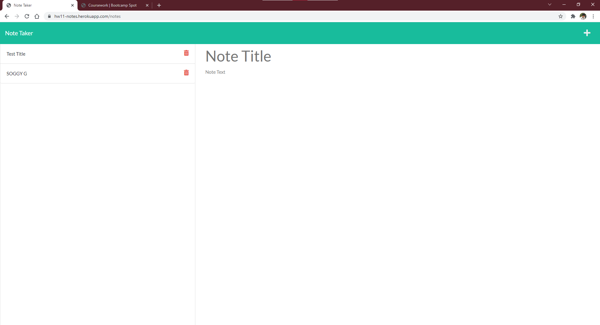

# HW11-Note-Taker

## Description

This project is a heroku-deployed note taking app with a JSON file acting as a database.

## Contents

-   [Installation](#installation)
-   [Usage](#usage)
-   [Contributors](#contributors)
-   [License](#license)
-   [Contact](#contact)

## Installation

To install this project locally, clone the database and have NPM/Node installed.

## Usage

Either use the deployment at [heroku](https://hw11-notes.herokuapp.com/), or run server.js locally using node.

## License

The project uses the [Do WTF You Want To](http://www.wtfpl.net/) license.

## Contact

Link to my github: [sagegrayson](https://github.com/sagegrayson)

If you'd like to contact me, email me at [skaseyg@gmail.com](mailto:skaseyg@gmail.com)
